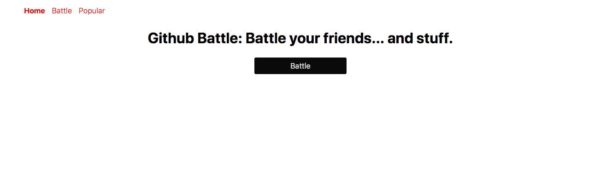
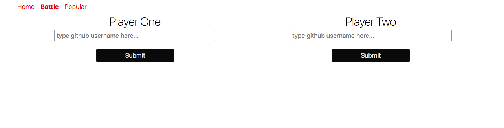
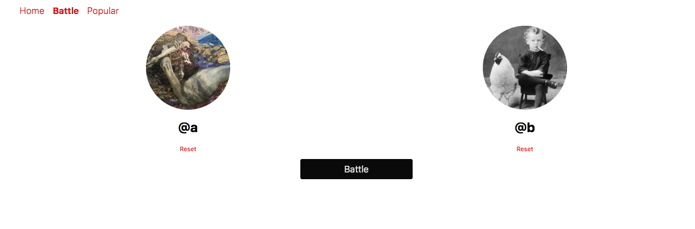
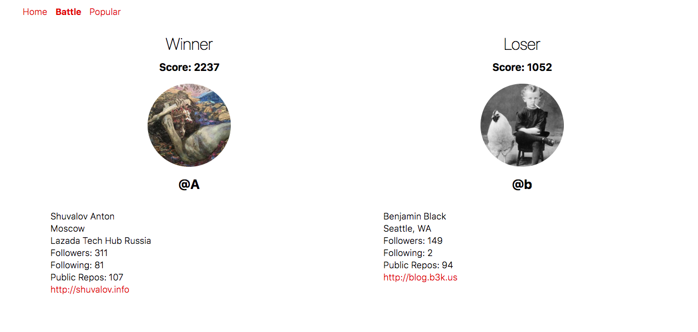

# Github Battle Game

> Github Battle: Battle your friends... and stuff.
>
> A [React App](https://github-battle-app-uivxubbrxw.now.sh/) implemented with [React](https://reactjs.org/) and [React Router](https://github.com/ReactTraining/react-router) and bootstrapped with [create-react-app](https://github.com/facebook/create-react-app).
>
> Try the live demo: [https://github-battle-app-uivxubbrxw.now.sh/](https://github-battle-app-uivxubbrxw.now.sh/)

----
 

# Screenshots

----
 

## Getting started

- `Branch` and/or `clone` the repo locally.
- `cd` into it
- install all the require packages: `npm i`
- build the project: `npm run build`
- start the project: `npm start`

----
 

## Features

Type any two Github usernames as you like, it will process a battle results for you. Or you may like to compare any Github users with yourself. Try it, it's fun!

----
 

## Description

This is a project of TylerMcGinnis.com's "React Fundamentals" course. I rewrite it on my own styles with the latest React features. I have to say this project is great and benefits me so much! Hope you new learner guys enjoy it and learn from it.

The [demo](https://github-battle-app-uivxubbrxw.now.sh/) is hosted by [Now](zeit.co), you should not miss having a try!